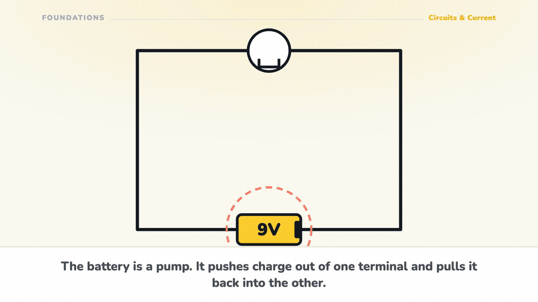

<p align="center">
  
</p>

<p align="center"><i>learn electronics by building, with a tutor that watches your bench</i></p>

<p align="center">
  A real-time multimodal tutor for <b>electronics, mechatronics and robotics</b>. It sees your<br>
  breadboard through the camera, hears you, and corrects the wire you are holding <b>before</b><br>
  you power it up. Not a chatbot about electronics. A tutor that watches you build one.
</p>

<p align="center">
  <b>Commercial product</b> &nbsp;·&nbsp; <a href="https://ohmlet.org">ohmlet.org</a> &nbsp;·&nbsp; iOS and web &nbsp;·&nbsp; Proprietary, all rights reserved
</p>

<p align="center">
  <a href="#the-live-tutor-is-the-product"><b>◆ How the tutor works&nbsp;→</b></a>
  &nbsp;&nbsp;·&nbsp;&nbsp;
  <a href="#the-learning-loop">The learning loop</a>
  &nbsp;&nbsp;·&nbsp;&nbsp;
  <a href="#architecture">Architecture</a>
  &nbsp;&nbsp;·&nbsp;&nbsp;
  <a href="#run-it">Run it</a>
  &nbsp;&nbsp;·&nbsp;&nbsp;
  <a href="#what-is-real-and-what-is-not">What is real</a>
</p>

<p align="center">
  
  
  
  
  
  
</p>

<p align="center">
  
</p>

---

## The problem

Electronics is learned at a bench, and every good explanation of it is a *motion*:
current moving, a capacitor filling, a transistor switching. Text cannot show
motion. A video cannot see your bench. A chatbot can see neither.

So beginners get stuck in the specific, lonely way that hardware makes you stuck:
the circuit does nothing, everything *looks* right, and there is nobody to ask.
The wire is one hole across and you cannot see it, because you do not yet know
that is a thing that happens.

## The live tutor is the product

A session opens a WebSocket to the Gemini Live API through Google ADK, streaming
**audio both ways and video one way** at once. The learner talks; the tutor talks
back in native audio, watching the bench through the camera the whole time.

Three things make it a tutor rather than a demo:

- **It sees the workspace, continuously.** Camera frames go up with the audio, so
  "is this right?" is answerable without describing anything.
- **It corrects mid-action.** The value is catching the wire before it is powered,
  not grading the result afterwards.
- **One voice, several models.** The live model handles conversation; component
  identification, Arduino code generation and deep debugging are dispatched to
  faster or stronger models behind it. The learner hears one tutor.

## The learning loop

1. Pick a build from the library, for example the light-activated alarm
2. The agent verifies your components through the camera before you start
3. It guides the wiring step by step, correcting mistakes as they happen
4. It generates and debugs the Arduino sketch with you
5. You run the circuit; it validates against serial output and what it can see
6. The session produces a **3D digital twin** of what you actually built
7. XP, streak, league position, and the build shared to the community if you want

Around that sits an authored curriculum: **12 units, 57 skills, 284 lessons,
2,355 steps**, with a checkpoint at every skill boundary and a **boss exam** at
the end of every unit that must be cleared before the next unit opens. Bosses
are composed server-side across every skill in the unit, graded server-side, and
cost no hearts, so they gate without punishing.

## Architecture

| Layer | What |
|---|---|
| Mobile | Expo SDK 54, React Native, expo-router, Reanimated, three.js via expo-gl |
| Web | React, TypeScript, Vite, Tailwind, three.js, Monaco |
| Live agent | Google ADK bidi-streaming over WebSocket to Gemini Live native audio |
| Services | FastAPI on Cloud Run, `europe-west1`, one service per concern |
| State | Firestore, server-owned for anything that costs money or gates progress |
| Media | GCS for session clips, twins and lesson films |
| Auth, billing | Firebase Auth, Stripe on web, RevenueCat on iOS |

Five independent services under `backend/`: `live-bridge` (the real-time core),
`quiz-engine`, `vision-verifier`, `compiler`, `reporter`. Each deploys on its own
and shares an observability spine: structured JSON logs correlated to Cloud Trace,
a token-guarded metrics endpoint, a security audit trail, and scoped CORS.

**The rule the money follows:** anything that costs money or gates progress is
decided on the server. Hearts, live-tutor minutes, twin quotas, checkpoint
payouts and boss results are all server-owned and idempotent, because a client
that computes its own entitlement can grant itself anything.

## Repo layout

```
mobile/      Expo app, the primary surface
frontend/    React web app and the marketing site
backend/     five FastAPI services, one folder each
video/       Remotion: the pitch film, and the lesson films
metadata/    the company brain: strategy, decisions, runbooks (not shipped)
tasks/       todo.md, the long-running plan
```

## Run it

```bash
# Web
cd frontend && npm install && npm run dev          # :3000

# Mobile
cd mobile && npm install && npx expo start

# The live agent (Python 3.13, NOT 3.14)
cd backend/live-bridge
python3 -m venv .venv && source .venv/bin/activate
pip install -r requirements.txt
PYTHONPATH=app uvicorn app.main:app --port 8082 --reload

# Deploy everything, or one service
./deploy.sh
./deploy.sh live-bridge
```

On Cloud Run with Vertex AI there is no API key: the service account is the auth.

## What is real, and what is not

Honest, because a README that overstates is worse than no README.

**Working today:** the live tutor with voice and vision; the full authored
curriculum on both surfaces; hearts, XP, streaks, leagues and achievements;
checkpoints and unit bosses; the community feed; the circuit simulator; the
component inventory check; Arduino compilation; account, privacy and erasure
flows; three lesson films rendered and published.

**Not finished:** the 3D twin pipeline needs one external key before it runs; a
CDN and adaptive bitrate for the lesson films; the remaining lesson films;
consumable in-app purchases; Interview Mode is built and Max-gated but barely
exercised.

---

<p align="center">
  <sub><b>Ohmlet</b> is proprietary software. See <a href="LICENSE">LICENSE</a>.<br>
  No licence is granted to use, copy, modify or distribute any part of it.</sub>
</p>
