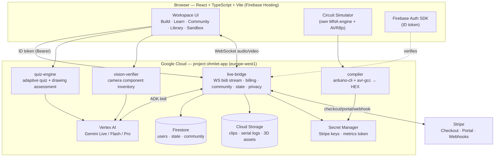

# Ohmlet — System Architecture

> Status: living document. Last reviewed 2026-06-26.

Ohmlet is a real-time, multimodal lab tutor for learning electronics by building.
A learner talks to it with the camera on; it watches their bench (breadboard,
Arduino, components) and guides the build with voice and vision. The product also
carries a full learning loop (authored curriculum, gamification, community) and a
commercial spine (accounts, billing, entitlements).

This document is the map: what the pieces are, how they talk, and where state
lives. For *why* the big choices were made, see the ADRs in [`adr/`](adr/). For
the request/response shapes, see [`api-contracts.md`](api-contracts.md).

## Topology

## Frontend

- **Stack:** React 18 + TypeScript 5 + Vite 5, Tailwind CSS 3. Three.js
  (`@react-three/fiber` + `drei`) for 3D, Monaco for the code editor, `avr8js`
  for in-browser Arduino execution.
- **Hosting:** Firebase Hosting (SPA; all paths rewrite to `index.html`).
- **Routing:** a small client-side router in `App.tsx` (history API, no router
  lib). Auth-sensitive routes are guarded; public marketing pages render
  instantly.
- **Identity:** Firebase Auth SDK holds the session and mints a short-lived ID
  token (JWT). Every backend call sends it as `Authorization: Bearer <token>`;
  the server verifies it (never trusts a client-supplied uid).
- **Analytics:** Firebase Analytics, consent-gated — collection does not start
  until the user opts in via the cookie banner (see ADR-0005).

## Backend — modular Cloud Run services

Each feature is its own folder under `backend/` and deploys as its own Cloud Run
service (ADR-0003). They share a copied "observability spine" (`obs.py`,
`cors.py`, `auth.py`, `ratelimit.py`, `resilience.py`) rather than a shared
library, so a service can be deployed and reasoned about in isolation.

| Service | Port | Responsibility | Key models |
|---------|------|----------------|------------|
| **live-bridge** | 8082 | The core. WebSocket bidi audio/video stream to the live tutor via Google ADK; also hosts billing, community, per-user state, and privacy (export/delete) routers. | `gemini-live-2.5-flash-native-audio`; dispatches to Flash/Pro tools |
| **quiz-engine** | 8083 | Adaptive quiz generation + drawing assessment (latency-critical). | `gemini-2.5-flash` / `gemini-3.5-flash` (global) |
| **vision-verifier** | 8084 | Camera component inventory check at session start. | Gemini 3.5 Flash vision |
| **compiler** | — | Compiles a learner's Arduino sketch (arduino-cli + avr-gcc) to Intel HEX, sandboxed. Source is compiled, never executed. | n/a |

Future: `reporter/` (3D digital-twin generation) — the one post-session artifact.

### The live session (the heart of the product)

1. Client opens `wss://…/ws/{user_id}/{session_id}` to live-bridge.
2. live-bridge authenticates, then bridges the socket to Gemini Live via ADK
   bidi-streaming (audio in/out + periodic camera frames).
3. The single live voice dispatches to other models through ADK **tool**
   functions: quick component checks → Flash; Arduino code-gen and deep
   debugging → Pro. The learner hears one voice; several models work behind it
   (ADR-0001 on multi-model dispatch lives in CLAUDE.md's design notes).

## State & data

- **Firestore** is the system of record:
  - users / profiles / entitlement plan (`/v1/me/plan`),
  - workspace state — completed lessons, XP, streak (`/v1/state/{uid}`),
  - community — posts, reactions, comments, challenges, members, weekly league.
  - Isolation is server-authoritative: the uid comes from the verified token and
    scopes every read/write (ADR-0004). Counters use Firestore atomic increments;
    money/XP paths are idempotent (#51).
- **Cloud Storage:** session clips, serial logs, generated 3D assets.
- **Secret Manager:** Stripe secret + webhook signing key, the `/internal/metrics`
  token. Never a secret in code or in the frontend (ADR on secrets, #46).

## Billing

Stripe Checkout for subscriptions; the webhook is the source of truth that writes
the plan to Firestore; the Customer Portal handles upgrades/cancellation.
Entitlements are enforced **server-side** per tier (Free/Pro/Max), not just hidden
in the UI (#56). Non-secret price IDs live in a gitignored deploy env file so test
and live mode differ without code changes.

## Observability

Structured JSON logs correlated with Cloud Trace, a token-guarded
`/internal/metrics` per service, a security audit trail (`obs.audit(...)`), and
clean 500s that never leak internals. See [`../ops/observability.md`](../ops/observability.md)
and `ops/alerting.sh`.

## Deployment

`deploy.sh` orchestrates everything: `./deploy.sh all` builds and deploys the four
services + the frontend; `./deploy.sh <service>` does one. Cloud Run uses
`--cpu-boost` everywhere; latency-critical or large-image services keep warm
instances (`--min-instances`, e.g. the compiler). Frontend ships via
`firebase deploy --only hosting`. CI (`.github/workflows/ci.yml`) gates every PR
on build + tests + dependency audit + secret scan.
